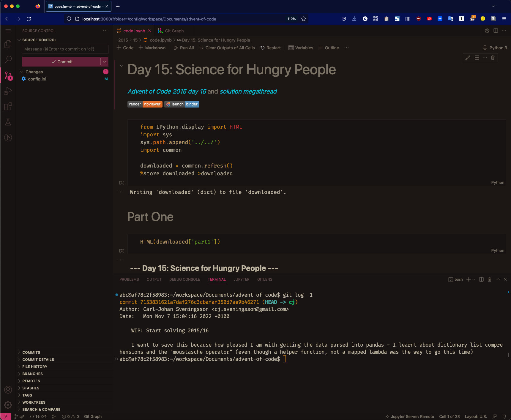

# A proof of concept openvscode-server capable of operating on Jupyter Notebooks

Intended to run on for instance a Raspberry Pi 4 (should work also even on 32-bit Raspberry Pi 3, but does require a hefty bit of CPU)
   
For now, a quirk of how code-server / Jupyter works with websockets is that the browser require you to connect locally, so perhaps forward a port to the container host for now:

    ssh -L 3000:localhost:3000 -t pi@pi4-raspberrypi.local "cd /home/pi/Downloads/my-openvscode-server; exec docker-compose up"

